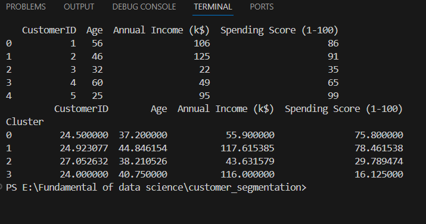

# Customer Segmentation using K-Means Clustering(H1)

This project demonstrates how to apply K-Means Clustering on synthetic customer data to segment them based on Annual Income and Spending Score.

🛠 Technologies Used
Python

Pandas

NumPy

Matplotlib

Seaborn

Scikit-learn

## 📊 Objective
To segment customers into different groups based on spending habits and income using machine learning (K-Means Clustering).

### 📁 Project Steps
#### 1. Import Libraries
import pandas as pd
import numpy as np
import matplotlib.pyplot as plt
import seaborn as sns
from sklearn.cluster import KMeans
from sklearn.preprocessing import StandardScaler
We import libraries for data handling, visualization, and machine learning.

#### 2. Generate Synthetic Customer Data
np.random.seed(42)
customer_id = np.arange(1, 51)
age = np.random.randint(18, 65, size=50)
annual_income = np.random.randint(15, 150, size=50)
spending_score = np.random.randint(1, 100, size=50)
We simulate data for 50 customers with:

Customer ID

Age (18–65)

Annual income (in thousands)

Spending score (1–100)

3. Create a DataFrame
df = pd.DataFrame({
    'CustomerID': customer_id,
    'Age': age,
    'Annual Income (k$)': annual_income,
    'Spending Score (1-100)': spending_score
})
We combine all customer details into a Pandas DataFrame.

4. Explore the Data
print(df.head())
This shows the first few records to understand the structure of the dataset.

5. Select Features for Clustering
X = df[['Annual Income (k$)', 'Spending Score (1-100)']]
We focus only on Annual Income and Spending Score for clustering.

6. Feature Scaling
scaler = StandardScaler()
X_scaled = scaler.fit_transform(X)
We scale the features to give them equal importance in clustering.

7. Find Optimal Clusters – Elbow Method
wcss = []
for i in range(1, 11):
    kmeans = KMeans(n_clusters=i, init='k-means++', random_state=42)
    kmeans.fit(X_scaled)
    wcss.append(kmeans.inertia_)
WCSS (Within-Cluster Sum of Squares) helps determine the optimal number of clusters.

We plot WCSS for cluster counts from 1 to 10.

8. Plot the Elbow Graph
plt.figure(figsize=(8, 5))
plt.plot(range(1, 11), wcss, marker='o')
plt.title('The Elbow Method')
plt.xlabel('Number of Clusters')
plt.ylabel('WCSS')
plt.show()
The elbow point in the graph suggests the best number of clusters. In this case, we assume 4 clusters.

9. Apply K-Means Clustering
kmeans = KMeans(n_clusters=4, init='k-means++', random_state=42)
y_kmeans = kmeans.fit_predict(X_scaled)
We apply K-Means using 4 clusters and get the predicted cluster label for each customer.

10. Add Cluster Labels to Dataset
df['Cluster'] = y_kmeans
We add the cluster results to the original DataFrame for reference and analysis.

11. Visualize Customer Segments
plt.figure(figsize=(8, 5))
sns.scatterplot(
    x=df['Annual Income (k$)'],
    y=df['Spending Score (1-100)'],
    hue=df['Cluster'],
    palette='tab10',
    s=100
)
plt.title('Customer Segments (Synthetic Data)')
plt.xlabel('Annual Income (k$)')
plt.ylabel('Spending Score (1-100)')
plt.legend()
plt.show()
This scatter plot visualizes the four different customer segments.

12. Cluster Analysis
print(df.groupby('Cluster').mean())
We analyze the average income and spending score per cluster to understand their behaviors. This helps interpret each segment, for example:

High income, high spending

Low income, high spending

High income, low spending

Low income, low spending

   
#✅ Conclusion
We successfully segmented customers into 4 groups using K-Means Clustering. This approach is valuable for targeted marketing, personalized recommendations, and customer retention strategies.
